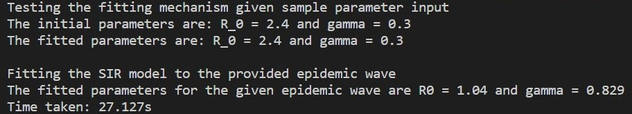
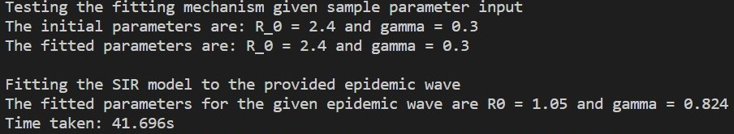
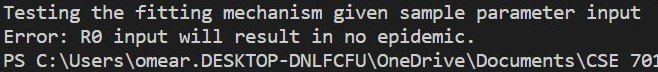

# **Final Project: Using C++ to fit the SIR model to a wave of epidemic data** ~ Elizabeth O'Meara ~ December 12, 2020

## Summary

I created this program to fit a simple SIR model to a wave of epidemic data, and output the parameters `R0` and `gamma` that provide the best fit to the provided data.

The program takes input from three .txt files. One that contains the daily new counts during an epidemic wave, another that provides the population size for the given epidemic data, and the last one contains sample parameters that are required to simulate an epidemic. Taking input of sample parameters is crucial as it allows us to ensure that when we simulate an epidemic with specific parameter values, we will get the same parameters back when we fit the model to the simulated data.

The program uses the RK4 method to solve the SIR model and the direct search method to find the pair of `R0` and `gamma` of 550 `R0` values and 900 `gamma` values that result in the minimum Least Squares Statistic, and thus the best fit.

## Implementation

### Namespace and libraries used in the program

The libraries used in this program can be seen in the code below.

``` cpp
#include <iostream>
#include <string>
#include <fstream>
#include <vector>
#include <iterator>
#include <algorithm>
#include <numeric>
#include <cmath>
#include <ctime>
```

This program uses the following code so that any function under the namespace `std` used in the program will not require `std::` before it.

``` cpp
using namespace std;
```

### Operator overloads and user-defined function sum

This program requires operator overloads for vector subtraction and multiplication. In both cases we must throw an exception when the sizes of the two vectors do not match. So first the class `size_must_match` is defined. Then the operator overloads for subtraction and multiplication are defined. The vector subtraction overload is defined as the norm ie. absolute value of the difference. In this overload I use the funciton `abs` as defined by the numerics library to take the absolute value of the difference between two vectors. Vector multiplication is defined as elementwise multiplication rather than the dot product. The code for `size_must_match` and the overloads can be seen below.

``` cpp
class size_must_match
{
};
```

``` cpp
vector<double> operator-(const vector<double> &vec1, const vector<double> &vec2)
{
    size_t s{vec1.size()};
    vector<double> vec3(s, 0);
    if (s != vec2.size())
    {
        throw size_must_match{};
    }
    for (size_t i{0}; i < s; i++)
    {
        vec3[i] = abs(vec1[i] - vec2[i]);
    }
    return vec3;
}
```

``` cpp
vector<double> operator*(const vector<double> &vec1, const vector<double> &vec2)
{
    size_t s{vec1.size()};
    vector<double> vec3(s, 0);
    if (s != vec2.size())
    {
        throw size_must_match{};
    }
    for (size_t i{0}; i < s; i++)
    {
        vec3[i] = vec1[i] * vec2[i];
    }
    return vec3;
}
```

Next, the user-defined function `sum` is created. This was required as the function `accumulate` as defined by the library `algorithm` does not result in the correct value as it does not include the final value in the vector. The code for `sum` can be seen below.

``` cpp
double sum(vector<double> vec)
{
    size_t s{vec.size()};
    double sum_of_vector;
    double sum_init{vec[0]};
    for (size_t i = 0; i < s - 1; i++)
    {
        sum_of_vector = sum_init + vec[i + 1];
        sum_init = sum_of_vector;
    }
    return sum_of_vector;
}
```

### Reading .txt files to obtain data and parameter input

As this program is intended to be object oriented, the entire program is based on user-defined classes. The first two classes `read_report` and `read_population` contain a constructor that take .txt file inputs and the member functions `getData()` which is a vector that will output the contents of the .txt files. The code for these classes can be seen below.

``` cpp
class read_report
{
    string fileName;

public:
    read_report(string filename) : fileName(filename)

    {
    }

    vector<double> getData();
};

class read_population
{

public:
    read_population(string filenamePop) : fileNamePop(filenamePop)

    {
    }
    double getData();

private:
    string fileNamePop;
};
```

The associated member function for `read_report` opens the .txt file input using `ifstream`, reads its contents and outputs them into a vector of doubles. The following code shows the implementation. The associated member function for `read_population` is similar, however it outputs a double since the .txt file only contains the population size.

``` cpp
    vector<double> read_report::getData()
{
    ifstream file{fileName};
    if (!file)
    {
        perror("Error opening input file");
    }

    vector<double> dataList;
    double test;

    while (file >> test)
    {
        dataList.push_back(test);
    }
    file.close();

    return dataList;
}

double read_population::getData()
{
    ifstream filePop;

    filePop.open(fileNamePop);

    double valuePop;
    filePop >> valuePop;
    filePop.close();
    return valuePop;
}
```

### Creating a class and member function that find the length of the reports vector

The class `get_timelength` contains a constructor that takes the input of a vector of doubles containing the epidemic data, ie. the output of `read_report::getData()`, and a member function `getLength()` that finds the length of the vector as an integer value. The code for `get_timelength` and `getLength()` can be seen below.

``` cpp
class get_timelength
{
public:
    get_timelength(vector<double> data) : Data(data)
    {
    }

    int getLength();

private:
    vector<double> Data;
};
```

``` cpp
int get_timelength::getLength()
{
    int length_of_time;

    for (size_t i = 0; i < Data.size(); i++)
    {
        if (Data[i] == Data.back())
        {
            length_of_time = i + 1;
        }
    }

    return length_of_time;
}
```

### Creating a class and member function that solve the SIR model

The next class `solve_SIR` contains a constructor that takes the input of several parameters and a member function `getSolve()` that will solve the SIR model using the RK4 method given the parameter input. The class itself also defines classes that will be used for exceptions in the member function `getSolve()`. The code of the class can be seen below.

``` cpp
class solve_SIR
{
public:
    solve_SIR(double input_N, double &input_I0, double &input_reproductionnumber, double &input_gamma, int input_totaltime)
        : N{input_N}, I0{input_I0}, reproductionnumber{input_reproductionnumber}, gamma{input_gamma}, totaltime{input_totaltime}
    {
    }
    vector<double> getSolve();

    class param_non_positive
    {
    };

    class no_epidemic
    {
    };

    class not_in_R0_range
    {
    };

    class not_in_gamma_range
    {
    };

private:
    double N, I0, reproductionnumber, gamma;
    int totaltime;
};
```

The associated member function `getSolve()` first defines exceptions to be thrown if the parameter inputs are not valid. Examples of invalid parameter values will be shown in the Sample Calculation section. If the parameter inputs are valid, `getSolve()` will solve the SIR model using the RK4 method. The code for `getSolve()` can be seen below.

``` cpp
vector<double> solve_SIR::getSolve()
{
    if (N <= 0)
    {
        throw param_non_positive{};
    }

    if (I0 <= 0)
    {
        throw param_non_positive{};
    }

    if (reproductionnumber <= 1)
    {
        throw no_epidemic{};
    }

    if (reproductionnumber > 6.5)
    {
        throw not_in_R0_range{};
    }

    if (gamma <= 0)
    {
        throw param_non_positive{};
    }

    if (gamma < 0.05)
    {
        throw not_in_gamma_range{};
    }

    if (gamma > 1)
    {
        throw not_in_gamma_range{};
    }

    vector<double> Snew(totaltime), Inew(totaltime), Rnew(totaltime);
    Snew[0] = N - I0;
    Inew[0] = I0;
    Rnew[0] = 0;
    vector<double> k1(2), k2(2), k3(2), k4(2);
    for (int i = 0; i < totaltime - 1; i++)
    {
        k1[0] = -reproductionnumber * gamma * Snew[i] * Inew[i] / N;
        k1[1] = (reproductionnumber * gamma * Snew[i] * Inew[i] / N) - gamma * Inew[i];

        k2[0] = (-reproductionnumber * gamma / N) * (Snew[i] + k1[0] / 2) * (Inew[i] + k1[1] / 2);
        k2[1] = ((reproductionnumber * gamma / N) * (Snew[i] + k1[0] / 2) * (Inew[i] + k1[1] / 2)) - gamma * (Inew[i] + k1[1] / 2);

        k3[0] = (-reproductionnumber * gamma / N) * (Snew[i] + k2[0] / 2) * (Inew[i] + k2[1] / 2);
        k3[1] = ((reproductionnumber * gamma / N) * (Snew[i] + k2[0] / 2) * (Inew[i] + k2[1] / 2)) - gamma * (Inew[i] + k2[1] / 2);

        k4[0] = (-reproductionnumber * gamma / N) * (Snew[i] + k3[0]) * (Inew[i] + k3[1]);
        k4[1] = ((reproductionnumber * gamma / N) * (Snew[i] + k3[0]) * (Inew[i] + k3[1])) - gamma * (Inew[i] + k3[1]);

        Snew[i + 1] = Snew[i] + ((k1[0] + 2 * k2[0] + 2 * k3[0] + k4[0]) / 6);
        Inew[i + 1] = Inew[i] + ((k1[1] + 2 * k2[1] + 2 * k3[1] + k4[1]) / 6);
        Rnew[i + 1] = N - Snew[i + 1] - Inew[i + 1];
    }
    return Inew;
}
```

### Creating a class that fits the SIR model to provided epidemic data

The final class used in this program is `fit_param`. This class contains a constructor that takes input from a vector containing a wave of epidemic data. This can either be from the member function `read_report::getSolve()` or from `solve_SIR::getSolve()` where the input for `solve_SIR` is from the sample parameter file. It also takes the input for the population size and length of the report vector. `fit_param` also has an associated member function `getParam()` that fits the SIR model to the provided data input. The code for the class `fit_param` can be seen below.

``` cpp
class fit_param
{
public:
    fit_param(vector<double> &input_reports, double input_popsize, int input_reportlength)
        : reports{input_reports}, popsize{input_popsize}, report_length{input_reportlength}
    {
    }
    vector<double> getParam();

private:
    vector<double> reports;
    double popsize;
    int report_length;
};
```

The associated member function `getParam()` first creates vectors containing the potential `R0` and `gamma` values. These are the estimates that the program will search through pairs of to find the best fit. To do so, for each value of `R0` a for loop iterates through the potential values of `gamma`. In this for loop the class `solve_SIR` is called with the given inputs and specified values of `R0` and `gamma`. Its associated member function `getSolve()` is then used to create a vector of estimated reports. This will then be used with the actual report input to calculate a value of the Least Squares (LS) statistic and outputs it as an entry in a 550x900 matrix. The above is iterated until each pair of `R0` and `gamma` results in a LS statistic.

Once there is a matrix containing values of the LS statistic for each pair of parameter estimates, `getParam()` finds the minmum value in the matrix using the function `min_element` as defined by the algorithm library and finds the `R0` and `gamma` values at which this occurs. Finally, the `R0` and `gamma` values that result in the best fit to the data are returned. The code for `getParam()` can be seen below.

``` cpp
vector<double> fit_param::getParam()
{
    vector<double> reproduction_estimates(550), gamma_estimates(900);
    double step_size_reproduction{0.01}, reproduction_start{1.01}, step_size_gamma{0.001}, gamma_start{0.05};

    reproduction_estimates[0] = reproduction_start;
    gamma_estimates[0] = gamma_start;

    for (int i = 0; i < 550 - 1; i++)
    {
        reproduction_estimates[i + 1] = reproduction_estimates[i] + step_size_reproduction;
    }

    for (int j = 0; j < 900 - 1; j++)
    {
        gamma_estimates[j + 1] = gamma_estimates[j] + step_size_gamma;
    }

    vector<vector<double>> LS_statistic(550, vector<double>(900));
    double I_init{1};
    vector<double> difference(report_length), difference_squared(report_length), reports_estimated(report_length);

    for (int i = 0; i < 550; i++)
    {
        for (int j = 0; j < 900; j++)
        {
            solve_SIR solve(popsize, I_init, reproduction_estimates[i], gamma_estimates[j], report_length);

            reports_estimated = solve.getSolve();

            try
            {
                difference = reports - reports_estimated;
            }
            catch (const size_must_match &e)
            {
                cout << "Error: Vector sizes don't match!\n";
            }

            try
            {
                difference_squared = difference * difference;
            }
            catch (const size_must_match &e)
            {
                cout << "Error: Vector sizes don't match!\n";
            }
            (LS_statistic[i])[j] = sum(difference_squared);
        }
    }

    vector<double> min_each_column(550);
    double min_LS;

    for (int m = 0; m < 550; m++)
    {
        min_each_column[m] = *min_element(LS_statistic[m].begin(), LS_statistic[m].end());
    }

    min_LS = *min_element(min_each_column.begin(), min_each_column.end());

    int min_r_location, min_gamma_location;

    for (int h = 0; h < 550 - 1; h++)
    {
        for (int l = 0; l < 900 - 1; l++)
        {
            if ((LS_statistic[h])[l] == min_LS)
            {
                min_r_location = h;
                min_gamma_location = l;
                break;
            }
        }
    }

    vector<double> fitted_params(2);
    fitted_params[0] = reproduction_estimates[min_r_location];
    fitted_params[1] = gamma_estimates[min_gamma_location];

    return fitted_params;
}
```

## Sample Outputs of the Program

### Output when given valid parameter inputs and 1918 Flu Data

This sample output was generated given a .txt file that contains 1918 Flu data for a wave in Philadelphia (data.txt), a .txt file that contains the population of Philadelphia in 1918 (population.txt) and a .txt file that contains sample parameters to test the fitting mechanism (params.txt). These sample files can be found in the same folder where this documentation exists.

First, we test the fitting mechanism using the params.txt input, where the parameter values in params.txt are valid (positive and R0 and gamma exist in the range defined in `fit_params::getParam()`). Then the other two .txt files are used to estimate `R0` and `gamma` for the 1918 flu in Philadelphia for the given wave. This is accomplished with the following code.

``` cpp
cout << "Testing the fitting mechanism given sample parameter input" << endl;
    try
    {
        read_report parameter_test("params.txt");
        vector<double> params_test;
        params_test = parameter_test.getData();

        solve_SIR test_solve(params_test[0], params_test[1], params_test[2], params_test[3], params_test[4]);
        vector<double> reports_test{test_solve.getSolve()};

        fit_param test_fit(reports_test, params_test[0], params_test[4]);
        vector<double> fitted_params_test{test_fit.getParam()};

        cout << "The initial parameters are: R_0 = " << params_test[2] << " and gamma = " << params_test[3] << endl;
        cout << "The fitted parameters are: R_0 = " << fitted_params_test[0] << " and gamma = " << fitted_params_test[1] << endl;
    }
    catch (const solve_SIR::param_non_positive &e)
    {
        cout << "Error: Parameter inputs have one or more negative values." << endl;
        return -1;
    }
    catch (const solve_SIR::no_epidemic &e)
    {
        cout << "Error: R0 input will result in no epidemic." << endl;
        return -1;
    }
    catch (const solve_SIR::not_in_R0_range &e)
    {
        cout << "Error: R0 input is not in the range of R0 used in the fitting mechanism." << endl;
        return -1;
    }
    catch (const solve_SIR::not_in_gamma_range &e)
    {
        cout << "Error: gamma input is not in the range of gamma values used in the fitting mechanism." << endl;
        return -1;
    }

    read_report read_data("data.txt");
    vector<double> real_reports{read_data.getData()};

    get_timelength length_of_reports(real_reports);
    int Timelength{length_of_reports.getLength()};

    read_population pop("population.txt");
    double pop_size{pop.getData()};

    fit_param epidemic_fit(real_reports, pop_size, Timelength);
    vector<double> fitted_epidemic_params{epidemic_fit.getParam()};
    cout << " " << endl;
    cout << "Fitting the SIR model to the provided epidemic wave" << endl;
    cout << "The fitted parameters for the given epidemic wave are R0 = " << fitted_epidemic_params[0] << " and gamma = " << fitted_epidemic_params[1] << endl;
```

The following is the output of the program with the inputs as defined above.



### Output when given valid parameter inputs and COVID-19 Data for Ontario's First Wave

The only difference here is that the report data is taken from covid_data.txt and the population data is from ontario_pop_size.txt. This results in the following output.



### Output when given invalid parameter inputs

This sample output was generated using the file params_invalid.txt. Here the value of `R0` is set to 0.5. This is invalid as it will not result in an epidemic. The output of this program can be seen below.



## Use of Debugging in this Project

In addition to the required concepts used in this program, debugging was also necessary. Before the final version of the code was complete, it resulted in several segmentation faults. Segmentation faults can be caused by many different issues. So in order to determine what was causing the fault, I used debugging. This was accomplished by adding an argument to the `"args":` section in tasks.json. Specifically, I got rid of `"-g"` and added `"-ggdb3"`. Once I was done debugging this was changed back to `"-g"`. I assigned breakpoints to different points in the code so that at each step I could use the variables window in the debugging area of VScode.

The first segmentation fault was because I was trying to access .txt files that were not in the programs working directory. I discovered this because at the breakpoint after `read_report::getData()` was called, in the variables section, the vector that should contain the information from the .txt file had no elements. This lead me to believe that the fault was caused becuase the program was trying to access a .txt file that it was not authorized to. This happens when the .txt file is not in the working directory of the program. However, this was strange becuase the .txt file was in the same workspace folder as the final_project.cpp file. To fix this issue I needed to check what working directory was defined. The working directory can be found in tasks.json in the `"options":` section beside `"cwd":`. By changing this to the workspace folder, ie. change it to `"cwd":"${workspaceFolder}"`, this segmentation fault was fixed as the working directory was changed to the workspace folder (where the .txt files already were).

The second segmentation fault was because `min_r_location` in `fit_param::getParam()` was `6828360` when the length of the `reproductionestimates` vector was 900 at the time. Using the debugger helped me determine why this was occuring. By putting a breakpoint after the calculation of `LS_statistic`, I could tell that before `min_r_location` was calculated, the vector of vectors of doubles or matrix `LS_statistic` had values of NAN after approximately 563 `R0` estimates and after approximately 900 `gamma` estiamtes. So when the function `*min_element` was called, the value was `NAN`, which resulted in a min_r_location being out of bounds. I was able to fix this issue by changing the range of `R0` values to include 550 `R0` estimates and 900 `gamma` estimates. This then got rid of the segmentation fault and the program ran smoothly afterwards.
