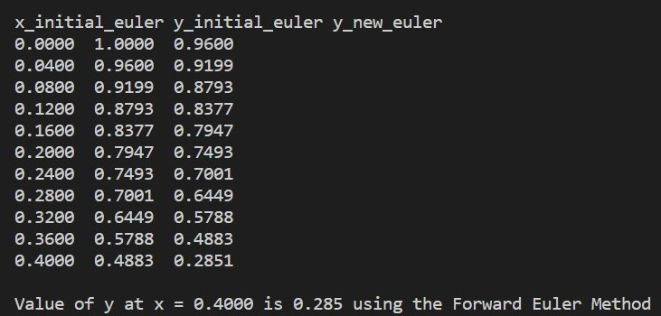
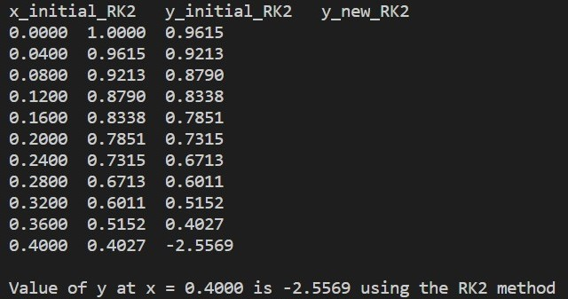

# **Project 1: Using C to Approximate the Solution of a Differential Equation** <br> Elizabeth O'Meara 400054293 <br> October 10, 2020

## Summary
I created this program to approximate the solution of a differential equation using two different methods, the Forward Euler and RK2 method. This program allows you to define the differential equation you wish to approximate and its associated parameters (initial values, value at which the equation should be estimated and how many steps you would like to take to get to the desired x value), and with this inforamtion will have an output providing the approximation.

## Implementation
The first step in the program is to define the function that you wish to approximate. The following sections show the example I use in the program. This can be changed to suit the user's needs. This will be the same equation used in the Forward Euler and RK2 method.

``` #define f(x, y) (x * x + y * y) / (x * x - y * y) ```

### Forward Euler Method
Once the differential equation is defined, I begin the code that will approximate its solution using the Forward Euler method. The first step is to initiate the variables which will be used throughout the code.

``` float x_initial_euler, y_initial_euler, step_size_euler, y_new_euler, x_new_euler; ``` 

``` int i_euler, number_of_steps_euler; ```
<br>

Now that the variables have been initialized, we need to assign them values. In my example, I would like to approximate the defined function at x = 0.4, with initial values of (x,y) = (0,1). This is done using the following code.

``` x_initial_euler = 0; ```

``` y_initial_euler = 1; ```

``` x_new_euler = 0.4; ```
<br>

We then choose the number of steps to reach a value of x = 0.4. For this example we chose 10. 

``` number_of_steps_euler = 10; ```
<br> 

Using these values, we can then calculate the step size using the following code. 

``` step_size_euler = (x_new_euler - x_initial_euler) / number_of_steps_euler; ```
<br>

Now that we have all of the required variable values, we can estimate the solution of the defined differential equation using the Forward Euler method. The following code uses a for loop to iterate the calculation of the new y value until we reach the y value evaluated at x = 0.4. 

``` printf("\nx_initial_euler\ty_initial_euler\ty_new_euler\n"); ```
    <br>
    ```for (i_euler = 0; i_euler < number_of_steps_euler + 1; (i_euler)++)```
    <br>
    ```{```
        <br>
        ``` y_new_euler = y_initial_euler + step_size_euler * f(x_initial_euler, y_initial_euler); ```
        <br>
        ``` printf("%0.4f\t%0.4f\t%0.4f\n", x_initial_euler, y_initial_euler, y_new_euler); ```
        <br>
        ``` x_initial_euler = x_initial_euler + step_size_euler;```
        <br>
        ``` y_initial_euler = y_new_euler; ```
        <br>
    ``` } ```
<br>

This code outputs a table containing the values of each iteration of the for loop. 
<br>

The last line of code for the Forward Euler method outputs a string telling you the value of y at x = 0.4. 

``` printf("\nValue of y at x = %0.4f is %0.3f using the Forward Euler Method", x_new_euler, y_new_euler); ```
<br>

Both outputs can be seen in the image below.



### RK2 Method
Once the differential equation is defined, I begin the code that will approximate its solution using the RK2 method. The first step is to initiate the variables which will be used throughout the code. This is very similar to the Forward Euler but using different variables.

``` float x_initial_RK2, y_initial_RK2, k1, k2, step_size_RK2, y_new_RK2, x_new_RK2; ```
<br>

``` int i_RK2, number_of_steps_RK2; ```
<br>

Now that the variables have been initialized, we need to assign them values. In my example, I would like to approximate the defined function at x = 0.4, with initial values of (x,y) = (0,1). This is done using the following code.

``` x_initial_RK2 = 0; ```
<br>

``` y_initial_RK2 = 1; ```
<br> 

``` x_new_RK2 = 0.4; ```
<br>

We then choose the number of steps to reach a value of x = 0.4. For this example we chose 10. 

``` number_of_steps_RK2 = 10;  ```
<br>

Using these values, we can then calculate the step size using the following code.

``` step_size_RK2 = (x_new_RK2 - x_initial_RK2) / number_of_steps_RK2; ```
<br>

Now that we have all of the required variable values, we can estimate the solution of the defined differential equation using the RK2 method. The following code uses a for loop to iterate the calculation of the new y value until we reach the y value evaluated at x = 0.4. 

``` printf("\nx_initial_RK2\ty_initial_RK2\ty_new_RK2\n"); ```
<br>
``` for (i_RK2 = 0; i_RK2 < number_of_steps_RK2 + 1; (i_RK2)++) ```
<br>
```{```
<br>
``` k1 = step_size_RK2 * f(x_initial_RK2, y_initial_RK2);```
<br>
``` k2 = step_size_RK2 * f(x_initial_RK2 + step_size_RK2, y_initial_RK2 + k1); ```
<br>
``` y_new_RK2 = y_initial_RK2 + (k1 + k2) / 2; ```
<br>
``` printf("%0.4f\t%0.4f\t%0.4f\n", x_initial_RK2, y_initial_RK2, y_new_RK2); ```
<br>
``` x_initial_RK2 = x_initial_RK2 + step_size_RK2; ```
<br>
``` y_initial_RK2 = y_new_RK2; ```
<br>
``` } ```
<br>
This code outputs a table containing the values of each iteration of the for loop. 
<br>

The last line of code for the RK2 method outputs a string telling you the value of y at x = 0.4. 

``` printf("\nValue of y at x = %0.4f is %0.4f using the RK2 method", x_new_RK2, y_new_RK2); ```
<br>

Both outputs can be seen in the image below.


