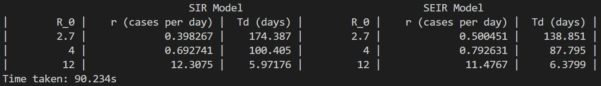

# **Project 2: Using C++ to Simulate Epidemics and Estimate the Corresponding Values of the growth rate, r, and the doubling time, Td.** ~ Elizabeth O'Meara 400054293 ~ November 8, 2020

## Summary

I created this program to simulate an epidemic and estimate the values of r and Td from the simulated data. The program uses the Gillespie Algorithm to simulate epidemic data using two models, the SIR model and the SEIR model. By inputting values for the population size, number of iterations, inital values of each compartment (S, E, I, R), gamma (where 1/gamma is the mean infectious period), sigma (where 1/sigma is the mean latent period), and birth/death rate, and the reproduction number R_0, the data is generated separately for the SIR and SEIR models. The growth rate r is then estimated as the slope of the initial growth phase of the log of the incidence data. Thus, the least squares method was used to fit a line to the corresponding data, where its slope = r. Once r is estimated, Td is calculated using the doubling time formula. The output of this program is a table comparing estimates of r and Td for the SIR and SEIR models for different values of R_0.

## Implementation

### Setting Namespace and Operator Overloading of Vector Addition, Subtraction, Addition of a Scalar to a Vector, and Multiplication

First, so that we wouldn't have to specify the namespace `std` in each line of the code, we set the namespace with the following code.

` using namespace std; `

Next, since this program will require specific methods of vector addition, subtraction, addition of a scalar to a vector and vector multiplication, the first step in the program is to define the different operator overloads. An example of this for the overload of * operator is as follows. Note that this is not the typical vector multiplication, but it is the type of multiplication required for a calculation in the program.

`vector<double> operator*(const vector<double> &v, const vector<double> &w)`\
`{`\
`size_t s{v.size()};`\
`vector<double> u(s, 0);`\
`if (s != w.size())`\
`throw size_must_match{};`\
`for (size_t i{0}; i < s; i++)`\
`u[i] += v[i] * w[i];`\
`return u;`\
`}`

### The Gillespie Algorithm

Before running the Gillespie Algorithm, the constants and vectors used in the code need to be initialized. `N` is the population size, `M` is the number of time steps, `t_0` is the initial time, `I_0` is the initial value of the infectious class, `R_0` is the initial value of the recovered class, `S_0_SIR` and `S_0_SEIR` are the initial values of the susceptible class for the corresponding models, `E_0_SEIR` is the initial value of the exposed class, `mu` is the birth/death rate, `gamma` is defined where `1/gamma` is the mean infectious period, and `sigma` is defined where `1/sigma` is the mean latent period. The following code shows a sample initialization with potential values for each (except for the vectors).

` const double N{5000000}; `\
` const int M{500000}; `\
` vector<double> susceptible_SIR(M); `\
` vector<double> infectious_SIR(M); `\
` vector<double> recovered_SIR(M); `\
` vector<double> event_time_SIR(M); `\
` vector<double> susceptible_SEIR(M); `\
` vector<double> exposed_SEIR(M); `\
` vector<double> infectious_SEIR(M); `\
` vector<double> recovered_SEIR(M); `\
` vector<double> event_time_SEIR(M); `
` double t_0{0}; `\
` double I_0{20}; `\
` double R_0{0}; `\
` double S_0_SIR{N - I_0 - R_0}; `\
` double E_0_SEIR{0}; `\
` double S_0_SEIR{N - I_0 - R_0 - E_0_SEIR}; `\
` double mu{0.02 / 365}; `\
` double gamma{0.25}; `\
` double sigma{0.25}; `

Next we assign the initial values of each compartment to the first element of its corresponding class vector. A sample is shown below.

` susceptible_SIR.assign(1, S_0_SIR); `

Now that we have the constants and vectors required for the Gillespie Algorithm initialized, a for loop that iterates `M` times, which contains the Gillespie Algorithm can be used. Within the for loop, the Gillespie Algorithm for both the SIR and SEIR model will be run in order to simulate data for each. The following two sections will show the code within the for loop that is used to simulate the epidemic data.

#### SIR Model

First we initialize `S_SIR`, `I_SIR` and `R_SIR`, and let them equal each element of their corresponing vectors. An example of this is shown below.

` double S_SIR{susceptible_SIR[i]}; `

Then we initialize the event rates, their sum and the corresponding event vectors as shown below.

` double a_1{N * mu}; `\
` double a_2{reproduction_number[j] * (gamma + mu) * S_SIR * I_SIR / N}; `\
` double a_3{gamma * I_SIR}; `\
` double a_4{mu * S_SIR}; `\
` double a_5{mu * I_SIR}; `\
` double a_6{mu * R_SIR}; `\
` double a_0{a_1 + a_2 + a_3 + a_4 + a_5 + a_6}; ` \
` vector<double> E_1{S_SIR + 1, I_SIR, R_SIR}; `\
` vector<double> E_2{S_SIR - 1, I_SIR + 1, R_SIR}; `\
` vector<double> E_3{S_SIR, I_SIR - 1, R_SIR + 1}; `\
` vector<double> E_4{S_SIR - 1, I_SIR, R_SIR}; `\
` vector<double> E_5{S_SIR, I_SIR - 1, R_SIR}; `\
` vector<double> E_6{S_SIR, I_SIR, R_SIR - 1}; `

Next, to calculate the time until the next event (`tnew`), a uniform deviate between (0, 1) needs to be generated. This is accomplished with the following code.

` random_device rd; `\
` mt19937 gen(rd()); `\
` uniform_real_distribution<> dis(0.0, 1.0); `\
` double u{dis(gen)}; `

This uniform deviate `u` is then used to calculate `tnew` in the following way.

` double t{event_time_SIR[i]}; `\
` double dt{(1 / a_0) * log(1 / (1 - u))}; `\
` double tnew{t + dt}; `

Next, to determine which event (`E_i`) occurs at `tnew`, a different uniform deviate between (0, a_0) needs to be generated. This can be seen below.

` random_device rd1; `\
` mt19937 gen1(rd1()); `\
` uniform_real_distribution<> dis1(0.0, a_0); `\
` double v{dis1(gen1)}; `

The last step in the code within the for loop is to determine the event (`E_i`) occurring at `tnew`. This is done using `else if` statements. Where the interval that `v` exists determines the event. This can be seen below.

` if (0 <= v && v < a_1) `\
` { `\
` event_time_SIR[i + 1] = tnew; `\
` susceptible_SIR[i + 1] = E_1[0]; `\
` infectious_SIR[i + 1] = E_1[1]; `\
` recovered_SIR[i + 1] = E_1[2]; `\
` } `\
` else if (a_1 <= v && v < a_1 + a_2) `\
` { `\
` event_time_SIR[i + 1] = tnew; `\
` susceptible_SIR[i + 1] = E_2[0]; `\
` infectious_SIR[i + 1] = E_2[1]; `\
` recovered_SIR[i + 1] = E_2[2]; `\
` } `\
` else if (a_1 + a_2 <= v && v < a_1 + a_2 + a_3) `\
` { `\
` event_time_SIR[i + 1] = tnew; `\
` susceptible_SIR[i + 1] = E_3[0]; `\
` infectious_SIR[i + 1] = E_3[1]; `\
` recovered_SIR[i + 1] = E_3[2]; `\
` } `\
` else if (a_1 + a_2 + a_3 <= v && v < a_1 + a_2 + a_3 + a_4) `\
` { `\
` event_time_SIR[i + 1] = tnew; `\
` susceptible_SIR[i + 1] = E_4[0]; `\
` infectious_SIR[i + 1] = E_4[1]; `\
` recovered_SIR[i + 1] = E_4[2]; `\
` } `\
` else if (a_1 + a_2 + a_3 + a_4 <= v && v < a_1 + a_2 + a_3 + a_4 + a_5) `\
` { `\
` event_time_SIR[i + 1] = tnew; `\
` susceptible_SIR[i + 1] = E_5[0]; `\
` infectious_SIR[i + 1] = E_5[1]; `\
` recovered_SIR[i + 1] = E_5[2]; `\
` } `\
` else `\
` { `\
` event_time_SIR[i + 1] = tnew; `\
` susceptible_SIR[i + 1] = E_6[0]; `\
` infectious_SIR[i + 1] = E_6[1]; `\
` recovered_SIR[i + 1] = E_6[2]; `\
` } `

After iterating the above code for the specified number of time steps (`M`), simulated epidemic data is successfully genereated.

#### SEIR

The methods used above in the SIR model are the same methods used for the SEIR model, except with the SEIR vectors, event rates, event vectors and uniform deviate between (0, b_0), where b_0 is the sum of the SEIR event rates.

### Determining the fitting window for the Least Squares Method

Now that the epidemic data has been generated for the SIR and SEIR models, the next step is to determine the window in which the Least Squares method will fit a line to approximate the growth rate `r` of the epidemics.

The first step is to take the ln of the incidence values. This is accomplished with the following code.

` vector<double> log_incidence(M); `\
` vector<double> log_incidence_SEIR(M); `

` for (i = 0; i < M - 1; i++) `\
` { `\
` log_incidence[i] = log(infectious_SIR[i]); `\
` log_incidence_SEIR[i] = log(infectious_SEIR[i]); `\
` } `

Next, to find the fitting window, the indecies at which the maximum and minimum values of the `log_incidence` and `log_incidence_SEIR` occur need to be found. The following code shows how this is accomplished for the maximum, however it is identical to the minimum except you use `min_element()` instead.

` double max_log_incidence = *max_element(log_incidence.begin(), log_incidence.end()); `\
` double max_log_incidence_SEIR = *max_element(log_incidence_SEIR.begin(), log_incidence_SEIR.end()); `\
` int max_location; `\
` int max_location_SEIR; `\
` for (i = 0; i < M - 1; i++) `\
` { `\
` if (log_incidence[i] == max_log_incidence) `\
` { `\
` max_location = i; `\
` break; `\
` } `\
` } `\
` for (i = 0; i < M - 1; i++) `\
` { `\
` if (log_incidence_SEIR[i] == max_log_incidence_SEIR) `\
` { `\
` max_location_SEIR = i; `\
` break; `\
` } `\
` } `

Now that the the fitting window is known, new vectors containing only the data required for the least squares fit can be created. An example is shown below for the SIR model but the same method is used for the SEIR model except the SEIR vectors are used.

` vector<double> least_square_data_incidence (max_location); `\
` for (i = 0; i < max_location - 1; i++) `\
` { `\
` least_square_data_incidence[i] = log_incidence[i]; `\
` } `\
` vector<double> least_square_data_event_time_SIR(max_location); `\
` for (i = 0; i < max_location - 1; i++) `\
` { `\
` least_square_data_event_time_SIR[i] = event_time_SIR[i]; `\
` } `

Lastly, the least squares method is used to estimate the growth rate r. An example of this is shown for the SIR model, however the same method is used for the SEIR model except with the corresponding SEIR vectors.

` double sum_least_square_data_incidence{accumulate(least_square_data_incidence.begin(), least_square_data_incidence.end(), 0)}; `\
` double sum_least_square_data_event_time_SIR{accumulate(least_square_data_event_time_SIR.begin(), least_square_data_event_time_SIR.end(), 0)}; `\
` double mean_least_square_data_incidence{sum_least_square_data_incidence / max_location}; `\
` double mean_least_square_data_event_time_SIR{sum_least_square_data_event_time_SIR / max_location}; `

` vector<double> dist_mean_incidence(max_location); `\
` vector<double> dist_mean_event_time_SIR(max_location); `\
` vector<double> dist_mean_event_time_SIR_squared(max_location); `\
` vector<double> multiply_dist_incidence_event_time_SIR(max_location); `\

` dist_mean_incidence = least_square_data_incidence - mean_least_square_data_incidence; `\
` dist_mean_event_time_SIR = least_square_data_event_time_SIR - mean_least_square_data_event_time_SIR; `\
` dist_mean_event_time_SIR_squared = dist_mean_event_time_SIR * dist_mean_event_time_SIR; `\
` multiply_dist_incidence_event_time_SIR = dist_mean_event_time_SIR * dist_mean_incidence; `

` double sum_multiply_dist_incidence_event_time_SIR{accumulate(multiply_dist_incidence_event_time_SIR.begin(), multiply_dist_incidence_event_time_SIR.end(), 0)}; `\
` double sum_dist_mean_event_time_SIR_squared{accumulate(dist_mean_event_time_SIR_squared.begin(), dist_mean_event_time_SIR_squared.end(), 0)}; `

` double r_growth_rate{sum_multiply_dist_incidence_event_time_SIR / sum_dist_mean_event_time_SIR_squared}; `

Once the growth rate `r_growth_rate` is estimated, the doubling time `Td` can be estimated using the doubling time formula. The following code shows the example for the SIR model, however the method is the same for the SEIR model but using the `r_growth_rate_SEIR` estimate for the SEIR model.

` double doubling_time{log(2) / log(1 + r_growth_rate / 100)}; `

Finally, `R_0` and the estimates of `r` and `Td` are outputted to the terminal.

### Sample Output of the Program

With inputs as defined above, below is a sample output of the program.

